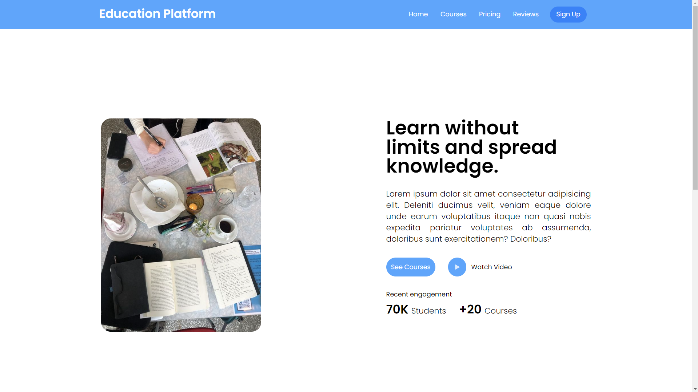

#  Education Platform

This is a project that I built using `Tailwind CSS`. Tailwind CSS is a utility-first CSS `framework` that allows for rapid development of custom designs.



# Features

Uses Tailwind CSS for styling
Clean and responsive design
Easy to customize
# Getting Started

To get started with this project, you will need to have Node.js and npm installed on your system. Once you have Node.js and npm installed, you can clone this repository and run the following commands to install the dependencies:

```Bash
npm install
```
This will install all of the dependencies that are required for the project to run.

# Running the project

Once you have installed the dependencies, you can start the development server by running the following command:

```
npm run dev
```
This will start the development server on port 3000. You can then access the project in your web browser by going to http://localhost:3000.

# Contributing

If you would like to contribute to this project, please fork the repository and create a pull request.

# License

This project is licensed under the `MIT License`.

# Additional Resources

`Tailwind CSS:` https://tailwindcss.com/docs/installation

`Node.js:` https://nodejs.org/en

`npm:` https://www.npmjs.com/